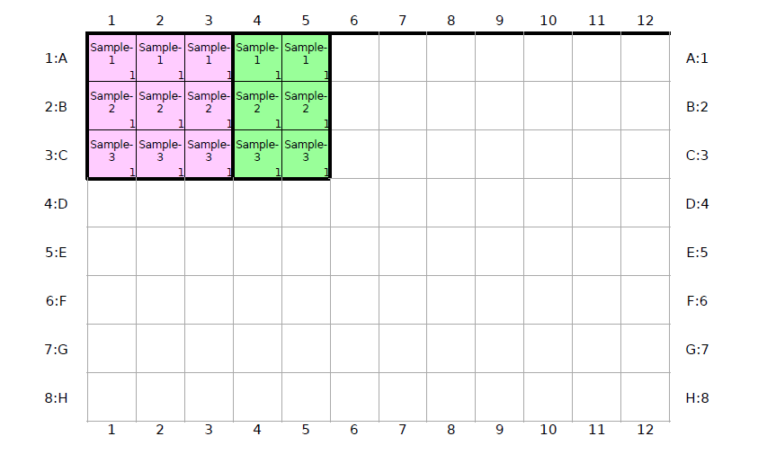

## Introduction

Imagine a situation where your client wants to perform a number of laboratory experiments on a number of samples.

Performing a laboratory *experiment*, in this context, means mixing small volumes of a *sample* (e.g. blood, cells, contained in e.g. small glass tubes) with a certain number of *reagents* (reagents are chemicals that trigger some form of reaction with samples). Normally, each individual sample will react slightly differently with the reagent, and this usually bears certain significance for the laboratory technician (=experiment results vary between different samples). The mixing is done separately for each sample-reagent combination, inside a small indentation on a plastic plate which is called a *well*. These wells are positioned on the plastic plate in a rectangular grid, with either 8 rows and 12 columns for a 96-well plate, or 16 rows and 24 columns for a 384 well plate.

To ensure better experiment results, individual sample-reagent mixtures are often placed into more than 1 well on the plate - this number is called experiment's *number of replicates*, e.g. samples & reagents (mixtures of same sample and same reagent) are placed into wells in multiple replicates.

## Task

Implement a function that will generate the content of the plate/s based on your input data about samples, reagents and replicates. **The purpose of the task is to optimize the placement logic of samples & reagents into wells, NOT user interface code.**

> Try to imagine that people reading your placement (e.g. laboratory technicians) will have to prepare a large number of plates (=pipette sample & reagent liquids into the wells that you defined) during their work day, which means that they will be tired and their attention will not be as sharp as it should be, so try to position the samples & reagents into the plate wells in a way that makes delivering the different samples and reagents as intuitive as possible (keep them close by and in a continuous area as much as possible, try to repeat the patterns from experiment to experiment, etc.).

### Inputs

The input data of your function consists of 5 variables:

1. the integer `96` or `384`, defining the plate size,
2. array of arrays of strings, which are the names of the samples assigned to the experiment (each array belongs to one experiment),
3. array of arrays of strings, which are the names of the reagents which belong to each experiment (again each array belongs to one experiment),
4. array of integers, where each integer defines the number of replicates for individual experiment,
5. maximum allowed number of plates.

An example function signature/call could look like this:

```
function(
  96,
  [['Sam 1', 'Sam 2', 'Sam 3'], ['Sam 1', 'Sam 3', 'Sam 4']],
  [['Reag X', 'Reag Y'], ['Reag Y', 'Reag Z']],
  [1, 3],
  1
);
```

### Outputs

Your output should consist of an array representing the wells of the plate, with each well containing a string with the name of sample and a string with the name of a reagent (or `null` if the well is empty).

An example result could look like this:

```
result = [
  [
    [['Sam 1', 'Reag X'], ['Sam 1', 'Reag Y'], ... , null],
    [['Sam 2', 'Reag X'], ['Sam 2', 'Reag Y'], ... , null],
    [['Sam 3', 'Reag X'], ['Sam 3', 'Reag Y'], ... , null],
    [null, ... , null],
    ...
    [null, ... , null]
  ], # Plate 1
  ...
];
```

*You can also use a different representation of data.*

### Constraints

* an array from list (2.), array from list (3.) and an integer from list (4.) with the same offset describe the same experiment,
* all reagent names are unique,
* a sample can be used in multiple experiments, but is never used in the same experiment multiple times,
* an experiment can be located on the same plate, or across multiple plates,
* the function should try to minimize the amount of plates (plates are expensive and are normally not reused),
* if it is impossible to place all wells on the maximum nr. of plates, function should return an error.

### Example

In the attached file you can find an example result for the following input:

```
function(
  96,
  [['Sample-1', 'Sample-2', 'Sample-3'], ['Sample-1', 'Sample-2', 'Sample-3']],
  [['<Pink>'], ['<Green>']],
  [3, 2],
  1
);
```

### Additional scope

* If you have time, implement a graphical display for your result as well.

### FAQ

* Which technology to use?
  * Whichever you are comfortable with for solving this problem.
* Are frameworks allowed?
  * Sure, use what you are comfortable with, except for libraries that solve the exact same problem.
* How can I deliver the solution?
  * Whatever you are most comfortable with, either in email with attachments or Git repository or anything in between. 
* What can I expect as input?
  * The solution should try to be as generalized as possible for any possible input.
* What kind of data combinations of sample and reagents can I expect?
  * Dimensions of input data can vary greatly; some labs use 1 sample, 100s of reagents, some other labs use 100 samples, 1 reagents, and majority of labs use something in-between.
* Is there a visual example?
  * Sure! 
